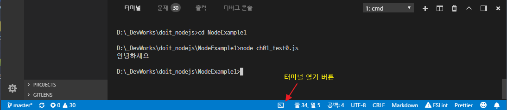

# 다시 시작하는 Do it! Node.js 프로그래밍

<a href="http://book.naver.com/bookdb/book_detail.nhn?bid=11738465" style="display:block; overflow:hidden;height:160px">
    
    <div>
        <h4 style="font-size:1.8em;line-height:1.4;margin:0;">Do it! Node.js 프로그래밍 <br/><small>실제 서버로 구동 가능한 코드를 배운다!</small></h4>
        <ul style="padding-left:20px;list-style:none;margin-top:1em;">
            <li>저  자 : 정재곤</li>
            <li>출판사 : 이지퍼블리싱</li>
            <li>출판일 : 2017.03.06</li>
        </ul>
    </div>
</a>

## 1. 기본 내용
 - 스터디 교재 : Do it! Node.js 프로그래밍
 - 스터디 시작 날짜 : 2018년 3월 18일
 - 스터디 종료 날짜 : 2018년 3월 30일
 - 스터디 완료 계획 : 14회 / 1회 챕터 1장 씩

## 2. 스터디 내용
- 스터디 목차 범위 : 2장. 노드 간단하게 살펴보기
----
### 02-1 첫 번째 프로젝트 만들기
 1. 이전 공부에서 만들어 둔 프로젝트 폴더 'doit_nodejs' 로 이동하여 `code .` 실행하여 VS Code를 실행한다.
  ```
   % cd doit_nodejs
   % code .
  ```
    - 아니면 테스크톱에서 VS Code 실행하여 파일 > 폴더 열기(Ctrl+K, Ctrl + O) > 대화상자에서 `doit_nodejs`폴더 열기
 2. 좌측 사이드바에서 마우스 오른쪽 버튼 > 단축메뉴 >  새 폴더 > `NodeExample1` 폴더 생성
 3. 생성된 `NodeExampl1` 폴더를 선택하고  오른쪽 버튼 > 단축메뉴 > 새 파일 > `ch01_test0.js`로 생성
 4. `ch01_test0.js` 에디터 화면에서 다음과 같이 입력하고 저장(Ctrl+S) 한다
    ```javascript
     console.log('안녕하세요');
    ```
 5. 하단 상태표시줄에서 터미널을 열고 해당 폴더에서 다음과 같이 명령어 입력하여 실행한다.
    
 6. 노드 관련 확장팩은 전 시간에 언급한 **Node.js Extension Pack**을 설치하면 된다.

### 02-2 콘솔에 로그 뿌리기
 * 노드의 전역 객체(Global Object) : Node Code 어디서나 사용이 import 없이 사용이 가능한 객체
   | 전역 객체 | 설명  |
   |-----------|--------|
   | console   | 콘솔창에 결과를 보여주는 객체 [API참조](https://nodejs.org/dist/latest-v9.x/docs/api/console.html)
   | process   | 프로세스의 실행에 대한 정보를 다루는 객체 [API참조](https://nodejs.org/dist/latest-v9.x/docs/api/process.html)
   | exports   | 모듈을 다루는 객체 [API참조](https://nodejs.org/dist/latest-v9.x/docs/api/modules.html#modules_exports)
   | 그 밖에   | 그 밖에 전역 변수,객체,함수 [API참조](https://nodejs.org/dist/latest-v9.x/docs/api/globals.html)

 * console 객체
   ```javascript
   // 콘솔에 hello world 출력
    console.log('hello world');
    console.log('hello %s', 'world');

    // 콘솔에 에러 메세지 출력
    console.error(new Error('Whoops, something bad happened'));

    // 콘솔에 경고 문구 출력
    const name = 'Will Robinson';
    console.warn(`Danger ${name}! Danger!`);

    /* -------- 실행 결과 ----------------------------------
    D:\WorkSpace\doit_nodejs\NodeExample1>node ch01_console.js
    hello world
    hello world
    Error: Whoops, something bad happened
        at Object.<anonymous> (D:\WorkSpace\doit_nodejs\NodeExample1\ch01_console.js:6:15)
        at Module._compile (module.js:643:30)
        at Object.Module._extensions..js (module.js:654:10)
        at Module.load (module.js:556:32)
        at tryModuleLoad (module.js:499:12)
        at Function.Module._load (module.js:491:3)
        at Function.Module.runMain (module.js:684:10)
        at startup (bootstrap_node.js:187:16)
        at bootstrap_node.js:608:3
    Danger Will Robinson! Danger
    -------------------------------------------------------*/
   ```
   ```javascript
   /* NodeExample1/ch02_test1.js */
    var result = 0;
    // 실행 시간 측정을 위한 시작 시간 기록
    console.time('duration_sum');

    for (var i = 1; i <= 1000; i++) {
        result += 1;
    }
    // 실애 시간을 측정을 위한 종료 시간 표시
    console.timeEnd('duration_sum');
    console.log('1부터 1000까지 더한 결과물 : %d', result); // %d 숫자, %s 문자열 

    console.log('현재 실행한 파일의 이름: %s', __filename);
    console.log('현재 실행한 파일의 경로: %s', __dirname);

    var Person = {
        name: '소녀시대',
        age: 20
    };
    // 자바스크립트 객체의 속성을 출력합니다.
    console.dir(Person);

    /* -------- 실행 결과 ----------------------------------
    D:\WorkSpace\doit_nodejs\NodeExample1>node ch02_test1.js
    duration_sum: 0.095ms
    1부터 1000까지 더한 결과물 : 1000
    현재 실행한 파일의 이름: D:\WorkSpace\doit_nodejs\NodeExample1\ch02_test1.js
    현재 실행한 파일의 경로: D:\WorkSpace\doit_nodejs\NodeExample1
    { name: '소녀시대', age: 20 }
    -------------------------------------------------------*/
   ```

### 02-3 Process 객체 살펴보기

  > | 속성/메소드 | 설명   |
  > |:------------|:-------|
  > | argv        | 프로세스를 실행할 때 전달되는 파라미터 정보
  > | env         | 환경 변수 정보
  > | version     | Node.js 버전 정보 (예: v8.9.4)
  > | versions    | Node.js와 종속된 프로그램 버전 정보
  > | arch        | 프로세서의 아키텍처를 정보 (예: x64)
  > | platform    | 플랫폼 정보 (예: win32, linux)
  > | exit([exitCode]) | 프로세스를 종료하는 메소드 (exitCode 기본값은 0)
  > | memoryUsage() | 메모리 사용 정보 객체 반환
  > | uptime()    | 현재 프로그램이 실행된 시간을 반환

  ```javascript
   /**
     *  Process 객체 살펴보기
     *  NodeExample1/ch02_test2.js
     */
    // 파라미터 정보 출력
    console.log('argv 속성의 파라미터 수 : ' + process.argv.length)
    console.dir(process.argv);

    // 세번째 파라미터가 존재하면 콘솔에 출력
    if (process.argv.length > 2) {
        console.log('세 번째 파라미터의 값 : %s', process.argv[2]);
    }

    // 파라미터 인덱스 번호와 값 출력
    process.argv.forEach(function(item, index) {
        console.log(index + ' : ', item);
    });

    // 사용자정의 환경변수, 시스템 환경변수 정보 출력
    console.dir(process.env); 
    console.log('OS 환경 변수의 값 : ' + process.env['OS']);

     /* -------- 실행 결과 ----------------------------------
    D:\WorkSpace\doit_nodejs\NodeExample1>node ch02_test2.js __port 7001
    argv 속성의 파라미터 수 : 4
    [ 'C:\\Program Files\\nodejs\\node.exe',
    'D:\\WorkSpace\\doit_nodejs\\NodeExample1\\ch02_test2.js',
    '__port',
    '7001' ]
    세 번째 파라미터의 값 : __port
    0 :  C:\Program Files\nodejs\node.exe
    1 :  D:\WorkSpace\doit_nodejs\NodeExample1\ch02_test2.js
    2 :  __port
    3 :  7001
    -------- 환경변수 내용이 길어서 실행 결과는 생략 ------
    OS 환경 변수의 값 : Windows_NT
    -------------------------------------------------------*/
  ```
### 02-4 노드에서 모듈 사용하기
 * exports를 사용한 모듈
  ```javascript
   // calc.js
    exports.add = function(a, b) {
    return a + b;
    }
    exports.subtract = function(a, b) {
        return a - b;
    }
    exports.multiply = function(a, b) {
        return a * b;
    }
    exports.divide = function(a, b) {
        if ( b === 0 ) {
            console.error('0으로 나눌 수 없습니다.')
            return;
        }
        return a / b;
    }
  ```
  ```javascript
    //NodeExample1/ch02_test5.js
    // calc 모듈 호출하여 cal 변수에 저장
    var calc = require('./calc');
    console.log('모듈로 분리한 후------->');
    console.log('calc.add 함수 호출 결과 : %d', calc.add(10, 10));
    console.log('calc.subtract 함수 호출 결과 : %d', calc.subtract(10, 10));
    console.log('calc.multiply 함수 호출 결과 : %d', calc.multiply(10, 10));
    console.log('calc.divide 함수 호출 결과 : %d', calc.divide(10, 10));
  ```

 * module.exports를 사용한 모듈

  ```javascript
   // NodeExample1/calc2.js
    var calc = {};
    calc.add = function(a, b) {
        return a + b;
    };
    calc.subtract = function(a, b) {
        return a - b;
    };
    calc.multiply = function(a, b) {
        return a * b;
    };
    calc.divide = function(a, b) {
        if ( b === 0 ) {
            throw new Error('0으로 나눌 수 없습니다.'); // 예외 처리를 함
        }
        return a / b;
    };

    module.exports = calc;
  ```
  ```javascript
    // NodeExample1/ch02_test5.js 
    // ----- 추가 ------
    // calc2 모듈 호출하여 cal2 변수에 저장
    var calc2 = require('./calc2');
    console.log('모듈로 분리한 후------->');
    console.log('calc2.add 함수 호출 결과 : %d', calc2.add(10, 10));
    console.log('calc2.subtract 함수 호출 결과 : %d', calc2.subtract(10, 10));
    console.log('calc2.multiply 함수 호출 결과 : %d', calc2.multiply(10, 10));
    console.log('calc2.divide 함수 호출 결과 : %d', calc2.divide(10, 10));
  ```
 * ES2015(ES6) 모듈 시스템 사용하기 : Node.js에서 ES6 모듈시스템을 지원하나 아직은 실험적이다.
  따라서 ES6 모듈시스템을 사용하기위해선 Babel이라는 컴파일러 모듈을 설치하거나 다음과 같은 방법으로 실행할 수 있다.

  ```javascript
    // NodeExample1/calc3.mjs 
    // ES모듈을 반드시 확장자를  .mjs로 한다. 안그러면 실행시 오류가 난다.

    const calc = {}
    calc.add = (a, b) => a + b; // ES6 화살표 함수 표현식
    calc.subtract = (a, b) => a - b;
    calc.multiply = (a, b) => a * b;
    calc.divide = (a, b) => {
        if ( b === 0 ) {
            console.error('0으로 나눌 수 없습니다.')
            return;
        }
        return a / b;
    }

    export default calc;
  ```
  ```javascript
    // NodeExample1/ch02_test5.mjs
    // 파일 확장자는 .mjs로 저장한다.
    import calc from './calc3';

    console.log('ES 모듈 시스템 사용 ------->');
    console.log('calc.add 함수 호출 결과 : %d', calc.add(10, 10));
    console.log('calc.subtract 함수 호출 결과 : %d', calc.subtract(10, 10));
    console.log('calc.multiply 함수 호출 결과 : %d', calc.multiply(10, 10));
    console.log('calc.divide 함수 호출 결과 : %d', calc.divide(10, 10));

    /* --- 실행 결과 ----------------------------------------------------
    D:\Workspace\doit_nodejs\NodeExample1>node --experimental-modules ch02_test5_es6.mjs
    (node:101168) ExperimentalWarning: The ESM module loader is experimental.
    ES 모듈 시스템 사용 ------->
    calc.add 함수 호출 결과 : 20
    calc.subtract 함수 호출 결과 : 0
    calc.multiply 함수 호출 결과 : 100
    calc.divide 함수 호출 결과 : 1
    --------------------------------------------------------------------*/
  ```
   ES6 모듈 시스템은 Node.js에서 실험중이라 `node --experimental-modules`이라는 명령어 옵션을 붙어 실행 해야 한다. 확장자도 꼭 .mjs로 저장하고 실행한다. 그렇지 않으면 `SyntaxError: Unexpected token import` 오류가 나오며 실행이 안된다.

   하지만 react, angular, vue.js를 사용하면서 점차 ES2015(ES6) 확대 되며 바벨(Babel)통한 컴파일이 가능해지며 사용되고 있다.

  > ES6 관련 참조사이트
  >  * [Babeljs 사이트](http://babeljs.io/)
  >  * [ZeroCho Blog - EcmaScript 관련자료 ](https://www.zerocho.com/category/EcmaScript)
  >  *  [Node.js API Docs - ECMAScript Modules](https://nodejs.org/dist/latest-v8.x/docs/api/esm.html)
  >  * [ES6 지원 브라우저](http://kangax.github.io/compat-table/es6/)

<br />

* 외장 모듈 사용하기 <br />
(1) `npm init -y` 초기화 하여 `package.json`파일을 생성한다.
 ```
  \doit_nodejs\NodeExample1> npm init
 ```
 package.json 파일 내용
 ```javascript
 {
  "name": "doit_nodejs",
  "version": "1.0.0",
  "description": "Do it! Node.JS Programming",
  "main": "main.js",
  "scripts": {
    "test": "echo \"Error: no test specified\" && exit 1"
  },
  "keywords": [
    "node.js"
  ],
  "author": "NodePlay",
  "license": "MIT",
  "dependencies": {
    "nconf": "^0.10.0" 
  }
}
 ```
(2) 외장 모듈을 설치해야 한다. 원하는 모듈을 찾기 위해서는 [npmjs.com](npmjs.com)에서 검색할 수 있다.

```
    npm install ncof --save
```

(3) 외장 모듈 불러와 실행해 보기

```javascript
 // NodeExample1/ch02_test6.js
 // 시스템 환경 변수에 접근할 수 있는 모듈 nconf 불러오기
 var nconf = require('nconf');
 nconf.env();
 console.log('OS 환경 변수의 값 : %s' , nconf.get('OS'));
```
#### * npm 명령어 살펴보기 *

| 명령 형식 | 설명 |
|:----------|------|
|npm install --save 모듈명 [모듈명2 ...] | 모듈을 의존형(dependencies)으로 설치한다.
|npm i -S  모듈명 [모듈명2 ...] |  위와 같은 명령의 축약 이다.
|npm install --dev-save 모듈명 [모듈명2 ...] | 모듈을 개발용(devDependencies)으로 설치한다.<br/> 개발 시에만 필요한 모듈을 설치한다.
|npm install -g 모듈명 [모듈명2 ...] | 전역 모듈로 설치한다. (주로 전역으로 실행 할 패키지를 설치한다.)
|npm uninstall 모듈명 [모듈명2 ...] | 모델을 제거한다.
|npm install | package.json를 참고로 하여 모듈을 설치한다.
|npm update  | package.json를 참고로 하여 모듈을 업데이트 한다.
|npm list 모듈명 | 설치된 모듈 목록에서 해당 모듈을 보여준다.
|npm search 모듈명 | 설치할 모듈을 검색 할 수 있다. 그냥 npmjs.com 검색이 좋음.

### 02-5 간단한 내장 모듈 사용하기
 * 시스템 정보를 알려주는 OS 모듈
  ```javascript
    // NodeExample1/ch02_test7.js
    var os = require('os');

    // OS 호스트 이름을 반환
    console.log('시스템의 hostname : %s', os.hostname());

    // 시스템의 사용 가능 메모리(freemem()) 와 전체 메모리(totalmem()) 용량을 반환
    console.log('시스템의 메모리 : %d / %d', os.freemem(), os.totalmem());

    // 시스템의 CPU 정보 배열을 반환
    console.log('시스템의 CPU 정보\n');
    console.dir(os.cpus()[0]);

    // 네트워크 인터페이스 정보를 담은 객체를 반환
    console.log('시스템의 네트워크 인터페이스 정보 \n');
    console.dir(os.networkInterfaces()); 
  ```

 * 파일 패스를 다루는 PATH 모듈 
  ```javascript
    // NodeExample1/ch02_test8.js

    var path = require('path');

    // 디렉토리 이름 함치기
    var directories = ['users', 'mike', 'docs'];
    // path.sep 현재 시스템의 디렉토리 분리 기호 \, /  
    var docsDirectory = directories.join(path.sep);
    console.log('문서 디렉토리 : %s', docsDirectory);

    // 디렉토리 이름과 파일 이름 합치기
    var curPath = path.join('/users/mike', 'notepad.exe');
    console.log('파일 패스 :  %s', curPath);

    //경로를 조합하여 절대경로를 반환한다.
    var resolvPath = path.resolve('users/mike', 'notepad.exe'); 
    console.log('절대 경로 :  %s', resolvPath); 

    var filename = 'C:\\Users\\mike\\notepad.exe';
    var dirname = path.dirname(filename); // 디렉토리 경로만 반환
    var basename = path.basename(filename); // 경로를 뺀 파일이름만 반환
    //var basename = path.basename(filename, '.exe'); // 확장자를 뺀 파일이름 반환
    var extname = path.extname(filename); // 파일 확장자 이름 반환
    console.log(`디렉토리 : ${dirname}s, 파일 이름: ${basename}, 확장자: ${extname}`);

    // 파일 패스 정보를 담은 객체 반환
    var pathInfo = path.parse(filename);
    console.log(`디렉토리 : ${pathInfo.dir}s, 파일 이름: ${pathInfo.base}, 확장자: ${pathInfo.ext}`);
  ```

----
## 3. 스터디 후기

### 오늘 스터디한 내용 중 발생한 문제, 어려웠던 점, 어떻게 해결했는지
    - 외장 모듈 nconf에서 nconf.get('OS') 값이 'undefined' 나옴 알고 보니 nconf.env() 빼먹음.
    - 역시 게시판에 글 올리는게 젤 어려움.

### 스터디 후 소감
    - 이 번장을 하면서 ES6 모듈시스템도 추가로 공부해 봤다. 추세를 볼 때 React, Vue.js 를 다루며  ES6 모듈 방식들이 보이는 것 같다.
    - 이 번장에 나오지 않는 내장형 모듈이나 메소드들은 본인이 [Node.js API Docs](https://nodejs.org/dist/latest-v8.x/docs/api/)를 참고하면 추가로 공부 해야 할 것 같다.

### 다음 스터디 예정일
    - 2018년 03월 20일
    
### 오늘의 인증 샷