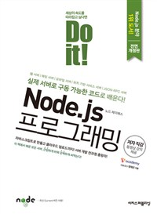

# 다시 시작하는 Do it! Node.js 프로그래밍

<a href="http://book.naver.com/bookdb/book_detail.nhn?bid=11738465" style="display:block; overflow:hidden;height:160px">
    
    

        <h4 style="font-size:1.8em;line-height:1.4;margin:0;">Do it! Node.js 프로그래밍  <small>실제 서버로 구동 가능한 코드를 배운다!</small></h4>
        <ul style="padding-left:20px;list-style:none;margin-top:1em;">
            <li>저  자 : 정재곤</li>
            <li>출판사 : 이지퍼블리싱</li>
            <li>출판일 : 2017.03.06</li>
        </ul>
    

</a>

## 1. 기본 내용
 - 스터디 교재 : Do it! Node.js 프로그래밍
 - 스터디 시작 날짜 : 2018년 3월 18일
 - 스터디 종료 날짜 : 2018년 3월 30일
 - 스터디 완료 계획 : 14회 / 1회 챕터 1장 씩

## 2. 스터디 내용
- 스터디 목차 범위 : 3장. 노드의 자바스크립트와 친해지기
----
###03-1. 자바스크립트의 객체와 함수 이해하기
###03-2. 배열 이해하기
###03-3. 콜백 함수 이해하기

일반적인 자바스크립 문법임 간단히 정리 되어 있음.
----
## 3. 스터디 후기

### 오늘 스터디한 내용 중 발생한 문제, 어려웠던 점, 어떻게 해결했는지
- 기본적인 자바스크립 문법 부분이라 어려운 부분은 없음

### 스터디 후 소감
- 어려움 없이 간단히 코딩만으로 넘어갔음.

### 다음 스터디 예정일
- 2018년 03월 21일
    
### 오늘의 인증 샷