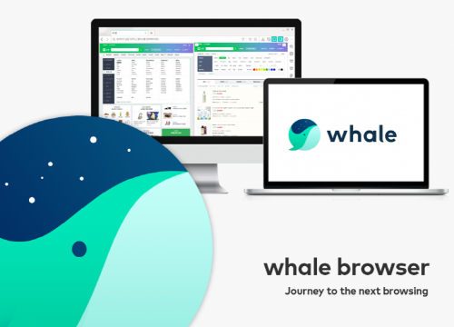
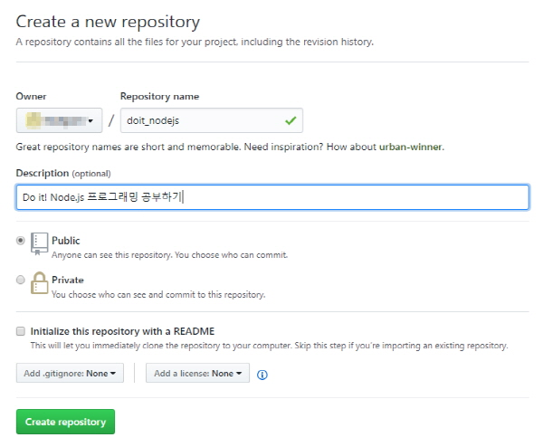

# 다시 시작하는 Do it! Node.js 프로그래밍

<a href="http://book.naver.com/bookdb/book_detail.nhn?bid=11738465" style="display:block; overflow:hidden;height:160px">
    
    <div>
        <h4 style="font-size:1.8em;line-height:1.4;margin:0;">Do it! Node.js 프로그래밍 <br/><small>실제 서버로 구동 가능한 코드를 배운다!</small></h4>
        <ul style="padding-left:20px;list-style:none;margin-top:1em;">
            <li>저  자 : 정재곤</li>
            <li>출판사 : 이지퍼블리싱</li>
            <li>출판일 : 2017.03.06</li>
        </ul>
    </div>
</a>

## 1. 기본 내용
 - 스터디 교재 : Do it! Node.js 프로그래밍
 - 스터디 시작 날짜 : 2018년 3월 18일
 - 스터디 종료 날짜 : 2018년 3월 30일
 - 스터디 완료 계획 : 14회 / 1회 챕터 1장 씩

## 2. 스터디 내용
- 스터디 목차 범위 : 1장. 노드에 대해 알아보고 개발 도구 설치하기
----
### 개발 도구 설치하기
 1. **NodeJS 설치하기** - [노드 사이트](https://nodejs.org/ko)에 접속하여 LTS(Long Term Support)버전으로 다운로드 받아 설치한다.
    > 우분투에서 설치 방법
    > ```shell
    >  curl -sL https://deb.nodesource.com/setup_8.x | sudo -E bash -
    >  sudo apt-get install -y nodejs
    > ```
 2. **개발 브라우저 설치하기** - 요즘 크롬이 무거워져(메모리를 마니 차지함),  [네이버의 **웨일(whale)** 브라우저](http://whale.naver.com/)를 설치하였다. 
 웨일은 하나의 창에서 두개의 페이지를 동시에 볼 수 있는 옴니태스킹을 지원한다.
 또한 크롬의 확장프로그램도 호환되어 사용할 수 있다.
 
   <center></center>
 
 3. **웹개발 IDE 설치하기** - 어도비 [브라켓(Brackets)](http://brackets.io/) 도 괜찮은 도구이지만 확장 프로그램 설치시 오류가 나는 부분이 있어 나에게는 안정적이지 못한 도구이다. 그래서 요즘 웹개발 도구로 각광받는 MS의 [Visual Studio Code(이하 VS Code)](https://code.visualstudio.com/)로 설치하고자 한다. 많은 확장 프로그램을 지원하고 있으며 꾸준한 버전업이 되고 있어 나름 안정적인 개발 도구이다.

    <center></center>
   
    > VS Code 추천 확장 패키지
    > - vscode-icons : 파일 아이콘 테마
    > - ESLint : 자바스크립트 Linter
    > - Debugger for Chrome : 
    > - Auto Close Tag : 자동으로 HTML/XML 태크의 닫기 태크를 만들어 준다.
    > - Auto Rename Tag : HTML/XML 태그 수정시 한 쌍의 태그 이름을 자동 수정한다.
    > - Rainbow Brackets :  중첩 되는 브라켓마다 다른 컬러를 입혀, 가독성을 높여준다.
    > - npm intellisense: npm 모듈을 import 할 때 자동완성 기능을 제공한다.
    > - Path Intellisense: src, url에 디렉토리 경로와 파일명 자동 완성 기능 제공
    > - Node.js Extension Pack: NodeJs 개발에 필요환 확장팩(위에 있는 확장팩 다수 포함)
    > - 그 밖에 확장기능이 많이 있음

 4. 버전관리를 위한 [Git](https://git-scm.com/) 설치 및 [Github](https://github.com/) 가입
    1. Git 프로그램 설치 - [Download 2.16.2 for Windows](https://git-scm.com/download/win)
    2. Git 메뉴얼 받기 - [Pro Git](https://git-scm.com/book/ko/v2),  [Git 간편 안내서](https://rogerdudler.github.io/git-guide/index.ko.html)
    3. Github 가입하기 - 온라인 Git 서비스를 무료로 무제한 이용 가능 (단 공개시, 비공개를 원할 경우 유료임. 무료 비공개 Git 서비스를 원하시면 [AWS](https://aws.amazon.com/ko/codecommit/) 나 [Visual Studio Team Services](https://www.visualstudio.com/ko/vso/) 사이트를 이용하세요.)
    4. 새로운 레포지터리 등록
      
    5. 프로젝트 폴더 만들고 Git 관리 설정하기
    ```shell
    mkdir doit_nodejs
    cd doit_nodjs

    git init
    git remote add https://github.com/유저명/doit_nodejs.git
    ```
    6. Git에서 제외 대상 설정 파일 .gitignore 파일 생성
    ```shell
    # 관리 하지 않을 파일, 폴더명 넣을 것
    bin/
    tmp/
    node_modules/
    build/
    *.log
    *.err
    ```
----
## 3. 스터디 후기

### 오늘 스터디한 내용 중 발생한 문제, 어려웠던 점, 어떻게 해결했는지
    - 그동안 개발 웹브라우저로 크롬을 마니 사용했는데 점점 무거워져서 현재는 네이버의 웨일이나 파이어폭스 개발자 버전 브라우저를 이용하고 있다.
    - 어도비 브라켓은 휼륭한 웹 IDE 툴이나 아직 안정성이 미흡한 것 같다.
    - 아톱(Atom) 이라는 웹 IDE 툴도 있으는 확장팩을 설치하면 프로그램이 무거워(메모리, CPU 사용률이 높음) 진다.

### 스터디 후 소감
    - 전에 한번 완독하고 익힌걸 써먹지 않아 잊어버려 다시 완독을 목표로 읽어 본다.
    - Node.js 다시 한번 읽어 생각을 정리하고자 한다.

### 다음 스터디 예정일
    - 2018년 03월 19일
### 오늘의 인증 샷